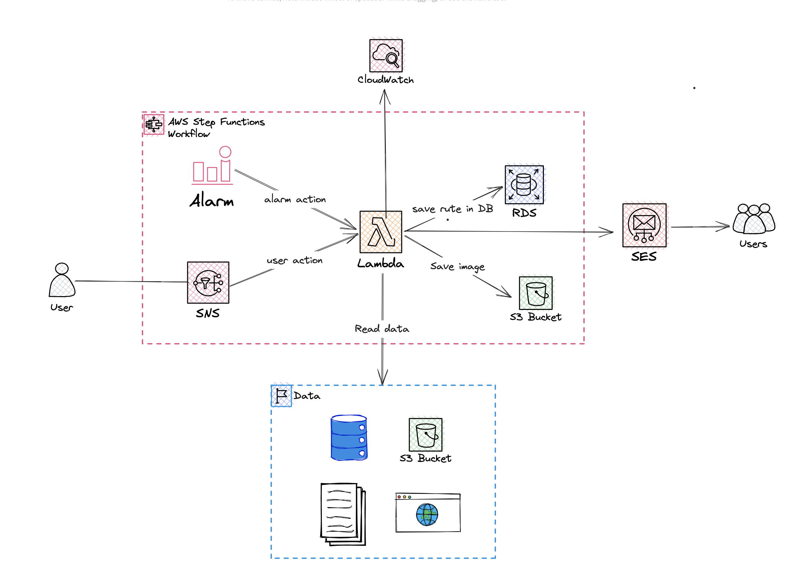

# Satellite-monitoring-api


En la siguiente aplicacion se usa una conecion a la api de la nasa (https://api.nasa.gov/?search=Landsat)
en la cual a partir de unos parametros se descargar una imagen y se sube a S3 en AWS.

# Primera Parte

En este repositorio se encuentra el código para subir una imagen a S3 sin descargarla en el local
dejando posibilidad de guardar en una base de datos la ruta de s3 para mayor facilidad al momento de descargar


# Estructura

````
├── .github/workflows       # Configuración del pipelina
├── app                     # Contiene el microservicio para subir iamgenes a s3
├── media                   # Contiene la imagen de la arquitectura 
├── test                    # test sobre los endpoint del microservicio
├── .gitignore              # 
├── Dockerfile              # Configuracion para la imagen de la aplicacion
├── example_info_nasa_earth # Datos de ejemplos para los test
├── requirements.txt        # requerimientos para la app
└── README.md               # Estás aquí
````


## Como ejecutar localmente la aplicación 

### Docker
1. Asegurarse de tener Docker y docker-compose instalado. Si actualmente no lo tiene instalado dirigirse
   a la pagina de docker para las intrucciones de instalación de su sistema operativo
2. Ubicarse sobre este directorio y ejecutar docker

```shell
docker build -t satelite-app .
docker run satelite-app
```
## Como ejecutar localmente un servicio

1. Situarse en el servicio 
2. Crear y activar entorno virtual env
3. Instalar dependencias
3. Subir servicio
```
cd ./carpertadelservicio/
python3 -m venv ./
source ./venv/Scripts/activate
pip install -r requirements.txt
uvicorn app.main:app --reload --host 0.0.0.0 --port 5000
```


## Segunda parte

Se plantea una arquitectura con una lambda funtion que reemplaza todo el micorservicio
este se activa por medio de un SNS o una alarma que ofreces AWS por si un usuario quiere guardar una 
imagen o se cree un cron que active la lambda function.

Despues de esto la funcion va leer los datos para consultar la app de la nasa y cuando tenga los datos
va guardar en S3 la imagen y en RDS la ruta donde esta la imagen guardada, para que cuando se requiere recuperar la imagen
o hacer algun tipo de ingenieria este a la mano y los costos sean mas bajos.

Finalmente se tiene un servicio de mensajeria que indique si la imagen se guardo o no, por lo que en la base de datos
se guarda las imagenes que no se guardaron para continuar le proces o notificar. Se agrega un servicio que monitoria la 
aplicacion.




## Tecnologias utilizadas
1. Postman
2. Python
3. Docker
4. FastApi
5. Github workflow
6. AWS
7. Git


